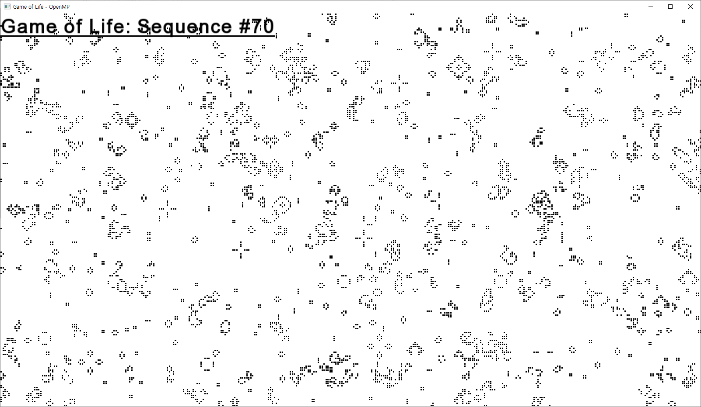
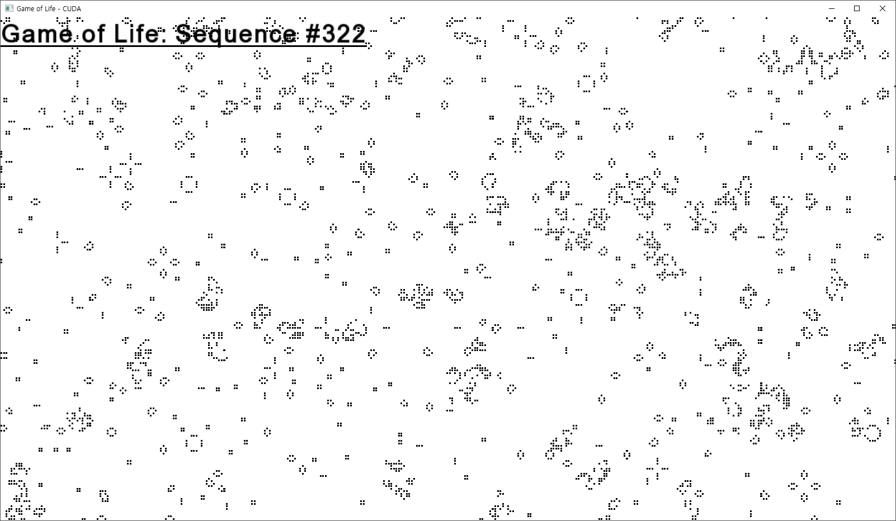

# Game_of_Life
John Conway's Game of Life in OpenMP, NVIDIA CUDA

[What is Game of Life?]([https://en.wikipedia.org/wiki/Conway%27s_Game_of_Life](https://en.wikipedia.org/wiki/Conway's_Game_of_Life))

## Environment

A development environment of this project is like below.

- Windows 10 v1909
- Visual Studio 2019(Community)
- SFML 2.5.1
- CUDA v10.2

We assume that you already installed CUDA and built your environment(e.g. environment variables, project settings) properly. We won't talk about how-to-install-cuda here.

## Usage

This project uses [SFML(Simple and Fast Multimedia Library)](https://www.sfml-dev.org/). You need to install SFML by following [document](https://www.sfml-dev.org/tutorials/2.5/start-vc.php) of official website. Once you installed SFML clone this project or download as zip.

`git clone https://github.com/Kwonkyu/Game_of_Life.git`

Then run executable with single parameter(generation limit).

`./game_of_life.exe 500`

This will run 500 sequences of game of life over OpenMP, CUDA each.

## Basic Idea

The basic idea of how to implement game of life algorithm into CUDA is...

### No Man's Land

### Thread Layout

A thread layout of this implementation is...

## Problem

The problems of this project is...

### Speed Drawback

### Unreliable Result

